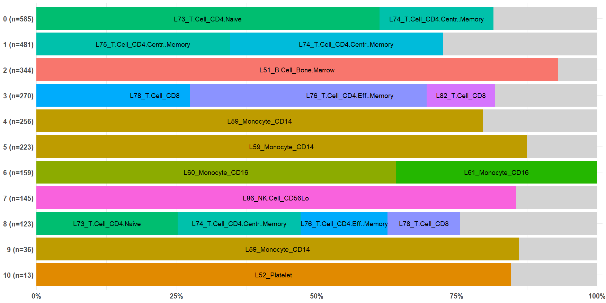

<!-- README.md is generated from README.Rmd. Please edit that file -->

```{r, include = FALSE}
knitr::opts_chunk$set(
  collapse = TRUE,
  comment = "#>",
  fig.path = "man/figures/README-",
  out.width = "100%"
)
```

# AnnotateCells

<!-- badges: start -->
<!-- badges: end -->

Cell type identification remains a key challenge in single-cell RNA-seq and spatial transcriptomics datasets despite a decade of research in this area.

There are many reference-based annotation tools to help with cell type annotation. However, the input and output formats differ greatly, increasing the burden on users to use and compare multiple tools. 

This package `AnnotateCells` aims to provide a unified wrapper to run several annotation tools conveniently.


## Installation

You can install AnnotateCells:

```{r, eval=FALSE}
library(remotes)
install_github("adairama/AnnotateCells")
```

# Illustration

## Demo dataset

We will load the `pbmc.demo` dataset. This is a Seurat object containing 2,635 peripheral blood mononuclear cells (PBMC) from 10X Genomics experiment. This is the same dataset used in the fundamental Seurat vignette after QC filtering with PCA and UMAP embedding. See help(pbmc.demo) for more details.

```{r dataset}
library(AnnotateCells)

data(pbmc.demo)

pbmc.demo@meta.data %>% head()
```
The authors of Seurat package provided `seurat_annotations`. However, we will use `RNA_snn_res.0.8` which represents the communities detected using Louvain algorithm at a resolution 0.8.

```{r}
pbmc.demo@meta.data %>% 
  janitor::tabyl(RNA_snn_res.0.8)
```

## Run RCAv2 annotation

Here is an example on how to run the RCAv2 tool with the GlobalPanel_CellTypes panel.

```{r example}
pred <- AnnotateCells(pbmc.demo, "RCAv2.GlobalPanel_CellTypes")

dim(pred)

head(pred)
```

Let us add the prediction to the Seurat object.

```{r}
pbmc.demo <- AddMetaData(pbmc.demo, pred)
```


## Aligning predicted cell type label with cluster group

With the exception of the DISCO reference tool, `AnnotateCells()` provides predictions at the individual cell level. Aligning these predicted cell type labels to cluster groups can be advantageous.
However, each cluster may contain multiple prediction labels as the cross table below demonstrates, 

```{r}
pbmc.demo@meta.data %>% 
  janitor::tabyl(ann.RCAv2.GlobalPanel_CellTypes, RNA_snn_res.0.8)
```

We can visualize this via
```{r, eval = FALSE}
align_prediction_to_cluster(
  prediction = pbmc.demo$ann.RCAv2.GlobalPanel_CellTypes,
  cluster    = pbmc.demo$RNA_snn_res.0.8,
  text.size  = 3
)
```

```{r, echo = FALSE}

```

Here is an alternative text output:

```{r, width="150%"}
align_prediction_to_cluster(
  prediction = pbmc.demo$ann.RCAv2.GlobalPanel_CellTypes,
  cluster    = pbmc.demo$RNA_snn_res.0.8,
  type       = "split"
)
```
