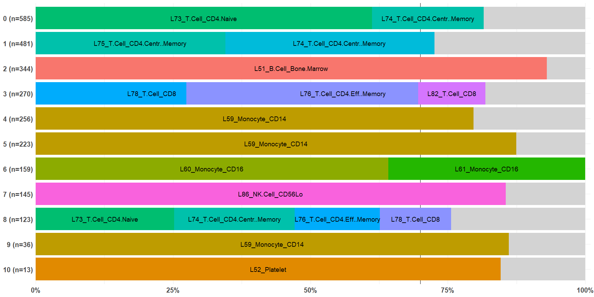

<!-- README.md is generated from README.Rmd. Please edit that file -->

```{r, include = FALSE}
knitr::opts_chunk$set(
  collapse = TRUE,
  comment = "#>",
  fig.path = "man/figures/README-",
  out.width = "100%"
)

options(width = 150)
```

# AnnotateCells

Cell type identification remains a key challenge in single-cell RNA-seq and spatial transcriptomics datasets despite a decade of research in this area.

There are many reference-based annotation tools to help with cell type annotation. However, the input and output formats differ greatly, increasing the burden on users to use and compare multiple tools. 

This package `AnnotateCells` aims to provide a unified wrapper to run several annotation tools conveniently.


# Installation

We can ensure all the necessary prerequisites are met via

```{r, eval=FALSE}
if (!requireNamespace("pacman", quietly = TRUE)) install.packages("pacman")

pacman::p_load(Seurat, SingleR, celldex, tidyverse)

pacman::p_load_gh("satijalab/Azimuth")
pacman::p_load_gh("prabhakarlab/RCAv2")
pacman::p_load_gh("lmw123/DISCOtoolkit")
```

Finally, you can install AnnotateCells:

```{r, eval=FALSE}
pacman::p_load_gh("adairama/AnnotateCells")
```


# Demo dataset

We will load the `pbmc.demo` dataset. This is a Seurat object containing 2,635 peripheral blood mononuclear cells (PBMC) from 10X Genomics experiment. This is the same dataset used in the fundamental Seurat vignette after QC filtering with PCA and UMAP embedding. See `help(pbmc.demo)` for more details.

First we load the required packages:
```{r dataset}
pacman::p_load(tidyverse, Seurat, AnnotateCells)
```


```{r}
data(pbmc.demo)

pbmc.demo
```


`pbmc.demo` includes two relevant columns in meta.data:

- `seurat_annotations`: author-provided cell type labels, used here as ground truth for evaluating annotation accuracy

- `RNA_snn_res.0.8`: cluster assignments generated by the Louvain algorithm at a resolution of 0.8, yielding 11 clusters which we will try to annotate

```{r}
pbmc.demo@meta.data %>% head()

# Note: this is a luxury since we have a ground truth
table(pbmc.demo$seurat_annotations, pbmc.demo$RNA_snn_res.0.8) 
```


# Available tools and panels

dt


References

- RCAv2: 
[Manuscript](https://doi.org/10.1093/nar/gkab632),
[GitHub](https://github.com/prabhakarlab/RCAv2)

- DISCO: 
[Manuscript](https://doi.org/10.1093/nar/gkab1020),
[DISCOtoolkit](https://github.com/JinmiaoChenLab/DISCOtoolkit),
[DISCO database](https://www.immunesinglecell.com/),
[Implementation website](https://www.immunesinglecell.com/tool/cellid)

- SingleR: 
[Manuscript](https://doi.org/10.1038/s41590-018-0276-y),
[Package](https://doi.org/doi:10.18129/B9.bioc.SingleR),
[celldex package for database](https://doi.org/doi:10.18129/B9.bioc.celldex)


# Run RCAv2 annotation

You can run the RCAv2 tool with the `GlobalPanel_CellTypes` panel. Then add the results to the meta data.

```{r}
pred <- AnnotateCells(pbmc.demo, "RCAv2.GlobalPanel_CellTypes")

head(pred)

pbmc.demo <- AddMetaData(pbmc.demo, pred)
```


# Run DISCO annotation

The first time you run the DISCO annotation, the required reference data (~175 MB) will be downloaded from the server. This may take a few minutes (< 5 min), depending on your internet speed. The downloaded data will be stored in the data directory of the `AnnotateCells` package for future use.

```{r}
pred <- AnnotateCells(pbmc.demo, "DISCO.all")

head(pred)

pbmc.demo <- AddMetaData(pbmc.demo, pred)
```


# Aligning annotation from cell-level to group-level

With the exception of the DISCO reference tool, `AnnotateCells()` provides predictions at the individual cell level. Aligning these predicted cell type labels to cluster groups can be advantageous.
However, each cluster may contain multiple prediction labels as the cross table below demonstrates, 

```{r}
table( pbmc.demo$RCAv2.GlobalPanel_CellTypes,
       pbmc.demo$RNA_snn_res.0.8 ) %>% 
  print(zero.print = ".")
```

It can be easier to visualize this information (e.g. cluster 3) via the following barplot. 
The segments are ordered in descending order of popularity until at least 70% of the cells are accounted for (you can adjust this using the `thres` parameter). The remaining labels are lumped together as Misc. and colored in grey.

```{r}
align_prediction_to_cluster(
  prediction = pbmc.demo$RCAv2.GlobalPanel_CellTypes,
  cluster    = pbmc.demo$RNA_snn_res.0.8 
)
```

```{r, echo = FALSE}
#
```

Here is an alternative text output:

```{r}
align_prediction_to_cluster(
  prediction = pbmc.demo$RCAv2.GlobalPanel_CellTypes,
  cluster    = pbmc.demo$RNA_snn_res.0.8,
  type       = "split"
)
```
