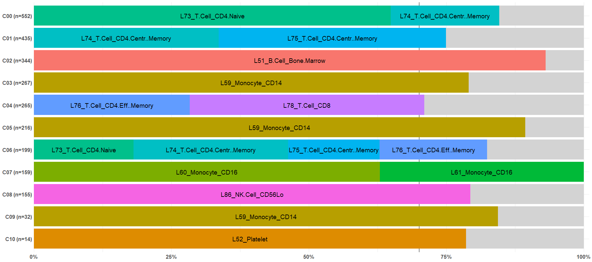

<!-- README.md is generated from README.Rmd. Please edit that file -->

```{r, include = FALSE}
knitr::opts_chunk$set(
  collapse = TRUE,
  comment = "#>",
  fig.path = "man/figures/README-",
  out.width  = "100%",
  out.height = "100%",
  message    = FALSE,
  warning    = FALSE
)

options(width = 160)
```

# AnnotateCells

Cell type identification remains a key challenge in single-cell RNA-seq and spatial transcriptomics datasets despite a decade of research in this area.

There are many reference-based annotation tools to help with cell type annotation. However, the input and output formats differ greatly, increasing the burden on users to use and compare multiple tools. 

This package `AnnotateCells` aims to provide a unified wrapper to run several annotation tools conveniently.


# Installation

We can ensure all the necessary prerequisites are met via

```{r, eval=FALSE}
if (!requireNamespace("pacman", quietly = TRUE)) install.packages("pacman")

pacman::p_load(Seurat, SingleR, celldex, tidyverse)

pacman::p_load_gh("satijalab/Azimuth")
pacman::p_load_gh("prabhakarlab/RCAv2")
pacman::p_load_gh("lmw123/DISCOtoolkit")
```

Finally, you can install AnnotateCells:

```{r, eval=FALSE}
pacman::p_load_gh("adairama/AnnotateCells")
```


# Demo dataset

We will load the `pbmc.demo` dataset. This is a Seurat object containing 2,635 peripheral blood mononuclear cells (PBMC) from 10X Genomics experiment. This is the same dataset used in the fundamental Seurat vignette after QC filtering with PCA and UMAP embedding. See `help(pbmc.demo)` for more details.

First we load the required packages and demo dataset.
```{r dataset}
pacman::p_load(tidyverse, Seurat, AnnotateCells)

data(pbmc.demo)
pbmc.demo
```

`pbmc.demo` includes two relevant columns in meta.data:

- `seurat_annotations`: author-provided cell type labels, used here as ground truth for evaluating annotation accuracy

- `RNA_snn_res.0.8`: cluster assignments generated by the Louvain algorithm at a resolution of 0.8, yielding 11 clusters which we will try to annotate

```{r}
pbmc.demo@meta.data %>% head()

# Note: this is a luxury since we have a ground truth
table(pbmc.demo$seurat_annotations, pbmc.demo$RNA_snn_res.0.8) 
```


# Available tools and panels

<details>
<summary>Click to expand to see available tools and panels</summary>

```{r, echo = FALSE}
data(allpanels_summary)
knitr::kable(allpanels_summary %>% select(-cell_type) %>% unique() %>% remove_rownames())
head(allpanels_summary)
```
</details>


[Full list of available tools, panels with the cell types.](https://github.com/adairama/AnnotateCells/blob/main/man/summary_all_panels.md).


Note: `DISCO.all` is also a valid combo, and it will annotate against all available DISCO panels listed in the table above.


# General reference for tools and panels used here

- RCAv2: 
[Manuscript](https://doi.org/10.1093/nar/gkab632),
[GitHub](https://github.com/prabhakarlab/RCAv2)

- DISCO: 
[Manuscript](https://doi.org/10.1093/nar/gkab1020),
[DISCOtoolkit](https://github.com/JinmiaoChenLab/DISCOtoolkit),
[DISCO database](https://www.immunesinglecell.com/),
[Implementation website](https://www.immunesinglecell.com/tool/cellid)

- SingleR: 
[Manuscript](https://doi.org/10.1038/s41590-018-0276-y),
[Package](https://doi.org/doi:10.18129/B9.bioc.SingleR),
[celldex package for database](https://doi.org/doi:10.18129/B9.bioc.celldex)


# Running one tool at a time

You can run the RCAv2 tool with the `GlobalPanel_CellTypes` panel. Then add the results to the meta data.

```{r}
pred <- AnnotateCells(pbmc.demo, "RCAv2.GlobalPanel_CellTypes")

head(pred)

pbmc.demo <- AddMetaData(pbmc.demo, pred)
```

# Running multiples tools simultaneously

```{r}
# Specify the tool.panel combination to test
to_test <- c("RCAv2.GlobalPanel_CellTypes",
             "DISCO.all",
             "SingleR.hpca.fine")

# Run tools and combine the results
preds <- lapply(to_test, AnnotateCells, obj = pbmc.demo)
preds <- do.call(cbind, preds)
head(preds)

# Add back to metadata
pbmc.demo <- AddMetaData(pbmc.demo, preds)
```


# Notes on annotation

1. The first DISCO annotation run triggers a one-time download of reference data (~175 MB) from the DISCO website, which may take up to 5 minutes. Once downloaded, the data is cached in the `AnnotateCells` package data directory and reused automatically in subsequent runs.

2. DISCO generates predictions at the group level, defined by the `Idents()`. These group-level predictions are automatically expanded to the cell level to ensure consistency with other annotation tools in the package.

3. For SingleR, the combo argument may be suffixed with `.main`, `.fine`, or `.ont` (e.g. "SingleR.hpca.main", "SingleR.hpca.fine"). Entries without a suffix default to `.main` (e.g. "SingleR.hpca" $\rightarrow$ "SingleR.hpca.main").


# Aligning annotation from cell-level to group-level

The tools considered here (except DISCO) generate predictions at the individual cell level. While useful, aligning these cell-level labels to cluster groups provide a broader perspective. 

However, a single cluster may contain multiple predicted cell types, as shown in the cross-tabulation below, which complicates matters.

```{r}
table( pbmc.demo$RCAv2.GlobalPanel_CellTypes,
       pbmc.demo$RNA_snn_res.0.8 ) %>% 
  print(zero.print = ".")
```


The `align_prediction_to_cluster()` function provides a convenient way to visualize annotation results at the cluster level. For each cluster, cell type labels are displayed as a stacked barplot, ordered by frequency in descending order until a cumulative threshold (default: 70%) is reached. Labels falling below this threshold are grouped into a "Misc." category and shown in grey. The threshold can be adjusted via the `thres` parameter.

You can also the size of the annotation labels using `text.size` (2 by default).

```{r}
lapply(to_test, function(combo){
  
  align_prediction_to_cluster(
    prediction = pbmc.demo@meta.data[ , combo],
    cluster    = pbmc.demo$RNA_snn_res.0.8,
    text.size  = 3
  ) + labs(title = combo)
})
```

```{r, echo = FALSE}
#
```


You can also return the output as text output using "split", "long" or "long.all". For example:

```{r}
align_prediction_to_cluster(
  prediction = pbmc.demo$RCAv2.GlobalPanel_CellTypes,
  cluster    = pbmc.demo$RNA_snn_res.0.8,
  type       = "split"
)
```
