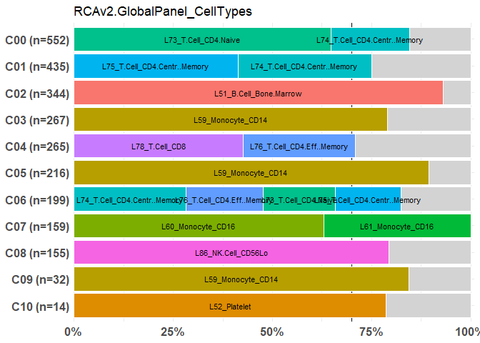
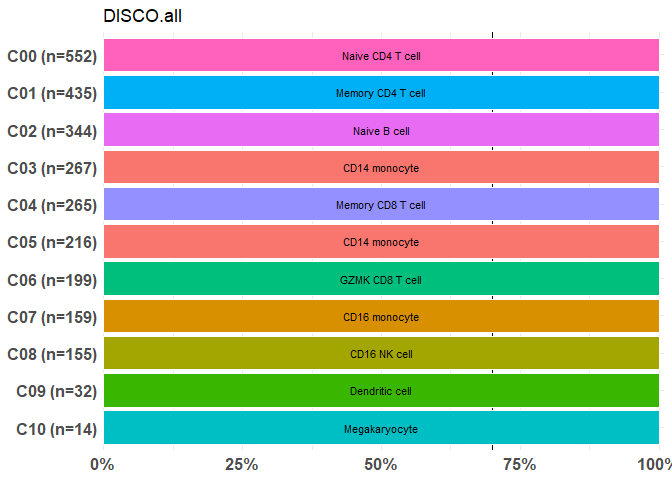
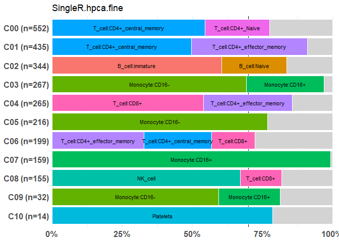

<!-- README.md is generated from README.Rmd. Please edit that file -->

# AnnotateCells

[](https://www.gnu.org/licenses/gpl-3.0)

Cell type identification remains a key challenge in single-cell RNA-seq
and spatial transcriptomics. While many reference-based annotation tools
exist, their input and output formats differ greatly, making it
cumbersome to run and compare multiple tools.

`AnnotateCells` provides a unified wrapper to run **RCAv2**, **DISCO**
and **SingleR** with a single function call, returning consistently
formatted outputs that can be directly added to your Seurat object’s
metadata.

# Installation

Install the required dependencies first:

``` r
if (!requireNamespace("pacman", quietly = TRUE)) install.packages("pacman")

pacman::p_load(Seurat, SingleR, celldex, tidyverse)

pacman::p_load_gh("satijalab/Azimuth")
pacman::p_load_gh("prabhakarlab/RCAv2")
pacman::p_load_gh("lmw123/DISCOtoolkit")
```

Then install `AnnotateCells`:

``` r
pacman::p_load_gh("adairama/AnnotateCells")
```

# Available tools and panels

<details>

<summary>

Click to expand available tools and panels
</summary>

| tool    | panel                          |
|:--------|:-------------------------------|
| RCAv2   | GlobalPanel_CellTypes          |
| RCAv2   | GlobalPanel_Tissues            |
| RCAv2   | CITESeqPanel                   |
| RCAv2   | ENCODEHumanPanel               |
| RCAv2   | ENCODEMousePanel               |
| RCAv2   | MonacoPanel                    |
| RCAv2   | MonacoBCellPanel               |
| RCAv2   | MonacoMonoPanel                |
| RCAv2   | MonacoTCellPanel               |
| RCAv2   | NovershternPanel               |
| RCAv2   | NovershternTCellPanel          |
| RCAv2   | ZhangMouseBrainPanel           |
| DISCO   | AD_frontal_cortex_parenchyma   |
| DISCO   | adipose_cell                   |
| DISCO   | adipose_nucleus                |
| DISCO   | adrenal_gland                  |
| DISCO   | basophil_mast_cell             |
| DISCO   | bladder                        |
| DISCO   | blood                          |
| DISCO   | bone_marrow                    |
| DISCO   | brain                          |
| DISCO   | breast                         |
| DISCO   | breast_milk                    |
| DISCO   | COVID-19_blood                 |
| DISCO   | Crohns_disease_ileum           |
| DISCO   | dengue_blood                   |
| DISCO   | eye                            |
| DISCO   | fibroblast                     |
| DISCO   | gingiva                        |
| DISCO   | heart                          |
| DISCO   | HIV_blood                      |
| DISCO   | HIV_cerebrospinal_fluid        |
| DISCO   | HNSCC_blood                    |
| DISCO   | intestine                      |
| DISCO   | kidney                         |
| DISCO   | liver_cell                     |
| DISCO   | liver_nucleus                  |
| DISCO   | lung                           |
| DISCO   | ovary                          |
| DISCO   | pancreas_cell                  |
| DISCO   | PDAC_pancreas                  |
| DISCO   | placenta                       |
| DISCO   | sarcoidosis_blood              |
| DISCO   | skeletal_muscle                |
| DISCO   | skin                           |
| DISCO   | stomach                        |
| DISCO   | testis                         |
| DISCO   | thymus                         |
| DISCO   | tonsil                         |
| DISCO   | type_1_diabetes_pancreas       |
| DISCO   | type_2_diabetes_pancreas       |
| SingleR | blueprint_encode.main          |
| SingleR | dice.main                      |
| SingleR | hpca.main                      |
| SingleR | immgen.main                    |
| SingleR | monaco_immune.main             |
| SingleR | mouse_rnaseq.main              |
| SingleR | novershtern_hematopoietic.main |
| SingleR | blueprint_encode.fine          |
| SingleR | dice.fine                      |
| SingleR | hpca.fine                      |
| SingleR | immgen.fine                    |
| SingleR | monaco_immune.fine             |
| SingleR | mouse_rnaseq.fine              |
| SingleR | novershtern_hematopoietic.fine |

</details>

For the full list including cell types, see
[summary_all_panels.md](https://github.com/adairama/AnnotateCells/blob/main/man/summary_all_panels.md).

Note: `DISCO.all` is also a valid `combo` argument, which annotates
against all available DISCO panels listed in the table above.

**References**

- RCAv2: [Manuscript](https://doi.org/10.1093/nar/gkab632),
  [GitHub](https://github.com/prabhakarlab/RCAv2)

- DISCO: [Manuscript](https://doi.org/10.1093/nar/gkab1020),
  [DISCOtoolkit](https://github.com/JinmiaoChenLab/DISCOtoolkit), [DISCO
  database](https://www.immunesinglecell.com/), [Implementation
  website](https://www.immunesinglecell.com/tool/cellid)

- SingleR: [Manuscript](https://doi.org/10.1038/s41590-018-0276-y),
  [Package](https://doi.org/doi:10.18129/B9.bioc.SingleR), [celldex
  package for database](https://doi.org/doi:10.18129/B9.bioc.celldex)

# Notes on annotation

1.  The first DISCO annotation run triggers a one-time download of
    reference data (~175 MB) from the DISCO website, which may take up
    to 5 minutes. Once downloaded, the data is cached in the
    `AnnotateCells` package data directory and reused automatically in
    subsequent runs.

2.  DISCO generates predictions at the group level, defined by
    `Idents()`. These group-level predictions are automatically expanded
    to the cell level to ensure consistency with other annotation tools
    in the package.

3.  For SingleR, the `combo` argument may be suffixed with `.main`,
    `.fine`, or `.ont` (e.g. `"SingleR.hpca.main"`,
    `"SingleR.hpca.fine"`). Entries without a suffix default to `.main`
    (e.g. `"SingleR.hpca"` → `"SingleR.hpca.main"`).

# Demo dataset

Load the required packages and the `pbmc.demo` dataset:

``` r
pacman::p_load(tidyverse, Seurat, AnnotateCells)

data(pbmc.demo)
pbmc.demo
#> An object of class Seurat 
#> 12519 features across 2638 samples within 1 assay 
#> Active assay: RNA (12519 features, 2000 variable features)
#>  2 layers present: counts, data
#>  2 dimensional reductions calculated: pca, umap
```

`pbmc.demo` is a Seurat object containing 2,635 peripheral blood
mononuclear cells (PBMC) from a 10X Genomics experiment — the same
dataset used in the standard Seurat vignette after QC filtering, with
PCA and UMAP embeddings precomputed. See `help(pbmc.demo)` for more
details.

Two columns in `meta.data` are relevant here:

- `seurat_annotations`: author-provided cell type labels, used as ground
  truth for evaluating annotation accuracy
- `RNA_snn_res.0.8`: cluster assignments from the Louvain algorithm at
  resolution 0.8, yielding 11 clusters (C00–C10) to be annotated

``` r
pbmc.demo@meta.data %>% head()
#>                nCount_RNA nFeature_RNA percent.mt seurat_annotations RNA_snn_res.0.8
#> AAACATACAACCAC       2419          779       3.02       Memory CD4 T             C06
#> AAACATTGAGCTAC       4903         1352       3.79                  B             C02
#> AAACATTGATCAGC       3147         1129       0.89       Memory CD4 T             C01
#> AAACCGTGCTTCCG       2639          960       1.74         CD14+ Mono             C03
#> AAACCGTGTATGCG        980          521       1.22                 NK             C08
#> AAACGCACTGGTAC       2163          781       1.66       Memory CD4 T             C01

# Cross-tabulation of ground truth labels vs clusters
table(pbmc.demo$seurat_annotations, pbmc.demo$RNA_snn_res.0.8)
#>               
#>                C00 C01 C02 C03 C04 C05 C06 C07 C08 C09 C10
#>   Naive CD4 T  534  15   0   0   0   0 148   0   0   0   0
#>   Memory CD4 T  18 420   0   0   2   0  43   0   0   0   0
#>   CD14+ Mono     0   0   0 263   0 216   0   1   0   0   0
#>   B              0   0 344   0   0   0   0   0   0   0   0
#>   CD8 T          0   0   0   0 263   0   8   0   0   0   0
#>   FCGR3A+ Mono   0   0   0   4   0   0   0 158   0   0   0
#>   NK             0   0   0   0   0   0   0   0 155   0   0
#>   DC             0   0   0   0   0   0   0   0   0  32   0
#>   Platelet       0   0   0   0   0   0   0   0   0   0  14
```

# Running the tool

Pass a vector of `"tool.panel"` string to `AnnotateCells()` to generate
cell-level predictions

``` r
chosen_panels <- c("RCAv2.GlobalPanel_CellTypes",
                   "DISCO.all",
                   "SingleR.hpca.fine")

preds <- AnnotateCells(pbmc.demo, chosen_panels)
#> 
#>  RCAv2.GlobalPanel_CellTypes
#> 
#>  GlobalPanel_CellTypes 
#> 12519 genes in query dataset.
#> 8883 genes detected in at least 1% of the samples.
#> 5209 genes in the reference panel.
#> 1192 genes in common used for projection.
#> 
#>  DISCO.all
#> 
#> 
#> |Ident |predict_cell_type_1 |source_atlas_1    | score_1|
#> |:-----|:-------------------|:-----------------|-------:|
#> |6     |GZMK CD8 T cell     |sarcoidosis_blood |   0.844|
#> |2     |Naive B cell        |sarcoidosis_blood |   0.838|
#> |1     |Memory CD4 T cell   |sarcoidosis_blood |   0.934|
#> |3     |CD14 monocyte       |COVID-19_blood    |   0.830|
#> |8     |CD16 NK cell        |bone_marrow       |   0.837|
#> |4     |Memory CD8 T cell   |dengue_blood      |   0.795|
#> |7     |CD16 monocyte       |HNSCC_blood       |   0.864|
#> |0     |Naive CD4 T cell    |HNSCC_blood       |   0.966|
#> |5     |CD14 monocyte       |COVID-19_blood    |   0.854|
#> |9     |Dendritic cell      |HNSCC_blood       |   0.891|
#> |10    |Megakaryocyte       |sarcoidosis_blood |   0.776|
#> 
#>  SingleR.hpca.fine

head(preds)
#>                 RCAv2.GlobalPanel_CellTypes         DISCO.all           SingleR.hpca.fine
#> AAACATACAACCAC L74_T.Cell_CD4.Centr..Memory   GZMK CD8 T cell  T_cell:CD4+_central_memory
#> AAACATTGAGCTAC       L51_B.Cell_Bone.Marrow      Naive B cell             B_cell:immature
#> AAACATTGATCAGC L75_T.Cell_CD4.Centr..Memory Memory CD4 T cell  T_cell:CD4+_central_memory
#> AAACCGTGCTTCCG            L60_Monocyte_CD16     CD14 monocyte              Monocyte:CD16-
#> AAACCGTGTATGCG           L86_NK.Cell_CD56Lo      CD16 NK cell                     NK_cell
#> AAACGCACTGGTAC L75_T.Cell_CD4.Centr..Memory Memory CD4 T cell T_cell:CD4+_effector_memory
```

Then add the result to your Seurat object’s metadata:

``` r
pbmc.demo <- AddMetaData(pbmc.demo, preds)
```

# Aligning predictions from cell-level to cluster-level

The tools above (except DISCO) generate predictions at the individual
cell level. Aligning these to cluster groups provides a broader
perspective, but a single cluster may contain multiple predicted cell
types:

``` r
table(pbmc.demo$RCAv2.GlobalPanel_CellTypes,
      pbmc.demo$RNA_snn_res.0.8) %>%
  print(zero.print = ".")
#>                                      
#>                                       C00 C01 C02 C03 C04 C05 C06 C07 C08 C09 C10
#>   L2_ESC                                .   .   .   .   .   .   1   .   .   .   .
#>   L45_CMP_Bone.Marrow                   4   .   .   .   .   .   1   .   .   .   1
#>   L48_Myelocyte_Bone.Marrow             .   .   .   .   .   2   .   .   .   .   .
#>   L51_B.Cell_Bone.Marrow                .   . 320   .   .   .   .   .   .   .   .
#>   L52_Platelet                          .   .   .   .   .   .   .   .   .   .  11
#>   L59_Monocyte_CD14                     .   .   . 211   . 193   .   .   .  27   .
#>   L60_Monocyte_CD16                     .   .   .  55   .  15   . 100   .   .   .
#>   L61_Monocyte_CD16                     .   .   .   .   .   .   .  59   .   .   .
#>   L62_Monocyte                          .   .   .   .   .   2   .   .   .   .   2
#>   L64_Macrophage_Monocyte.derived       .   .   .   1   .   4   .   .   .   .   .
#>   L69_Dendritic.Cell_Monocyte.derived   .   .   .   .   .   .   .   .   .   1   .
#>   L72_Dendritic.Cell_Plasmacytoid       .   .   .   .   .   .   .   .   .   4   .
#>   L73_T.Cell_CD4.Naive                358  50   .   .   .   .  36   .   .   .   .
#>   L74_T.Cell_CD4.Centr..Memory        109 146   .   .  21   .  56   .   .   .   .
#>   L75_T.Cell_CD4.Centr..Memory         65 180   .   .   .   .  33   .   .   .   .
#>   L76_T.Cell_CD4.Eff..Memory            6  56   .   .  75   .  39   .   .   .   .
#>   L77_T.Cell_CD8.Centr..Memory          .   .   .   .   4   .   1   .   .   .   .
#>   L78_T.Cell_CD8                        2   2   .   . 113   .  16   .   7   .   .
#>   L80_T.Cell_CD8.Eff..Memory            8   .   .   .   .   .   8   .   .   .   .
#>   L81_T.Cell_CD8.Naive                  .   .   .   .   2   .   3   .   .   .   .
#>   L82_T.Cell_CD8                        .   1   1   .  32   .   4   .   6   .   .
#>   L85_NK.Cell_CD56Hi                    .   .   .   .   3   .   1   .  19   .   .
#>   L86_NK.Cell_CD56Lo                    .   .   .   .  15   .   .   . 123   .   .
#>   L89_B.Cell                            .   .   2   .   .   .   .   .   .   .   .
#>   L90_B.Cell_Naive                      .   .  16   .   .   .   .   .   .   .   .
#>   L92_B.Cell_Memory                     .   .   2   .   .   .   .   .   .   .   .
#>   L93_B.Cell_Plasma.Cell                .   .   3   .   .   .   .   .   .   .   .
```

The `align_prediction_to_cluster()` function visualizes this as a
stacked barplot. For each cluster, cell type labels are ordered by
frequency (highest at the left) until a cumulative threshold is reached
(default: 70%). Labels below the threshold are collapsed into a grey
“Misc.” bar. Adjust the threshold with `thres` and label size with
`text.size` (default: 2).

``` r
lapply(chosen_panels, function(combo) {
  align_prediction_to_cluster(
    prediction = pbmc.demo@meta.data[, combo],
    cluster    = pbmc.demo$RNA_snn_res.0.8,
    text.size  = 3
  ) + labs(title = combo)
})
#> [[1]]
```



    #> 
    #> [[2]]



    #> 
    #> [[3]]



The function also supports text output formats via the `type` argument
(`"split"`, `"long"`, or `"long.all"`):

``` r
align_prediction_to_cluster(
  prediction = pbmc.demo$RCAv2.GlobalPanel_CellTypes,
  cluster    = pbmc.demo$RNA_snn_res.0.8,
  type       = "split"
)
#> $C00
#>   cluster                   prediction   n      prop   cumprop
#> 1     C00         L73_T.Cell_CD4.Naive 358 0.6485507 0.6485507
#> 2     C00 L74_T.Cell_CD4.Centr..Memory 109 0.1974638 0.8460145
#> 3     C00                        Misc.  85 0.1539855 1.0000000
#> 
#> $C01
#>   cluster                   prediction   n      prop   cumprop
#> 4     C01 L75_T.Cell_CD4.Centr..Memory 180 0.4137931 0.4137931
#> 5     C01 L74_T.Cell_CD4.Centr..Memory 146 0.3356322 0.7494253
#> 6     C01                        Misc. 109 0.2505747 1.0000000
#> 
#> $C02
#>   cluster             prediction   n       prop   cumprop
#> 7     C02 L51_B.Cell_Bone.Marrow 320 0.93023256 0.9302326
#> 8     C02                  Misc.  24 0.06976744 1.0000000
#> 
#> $C03
#>    cluster        prediction   n      prop   cumprop
#> 9      C03 L59_Monocyte_CD14 211 0.7902622 0.7902622
#> 10     C03             Misc.  56 0.2097378 1.0000000
#> 
#> $C04
#>    cluster                 prediction   n      prop   cumprop
#> 11     C04             L78_T.Cell_CD8 113 0.4264151 0.4264151
#> 12     C04 L76_T.Cell_CD4.Eff..Memory  75 0.2830189 0.7094340
#> 13     C04                      Misc.  77 0.2905660 1.0000000
#> 
#> $C05
#>    cluster        prediction   n      prop   cumprop
#> 14     C05 L59_Monocyte_CD14 193 0.8935185 0.8935185
#> 15     C05             Misc.  23 0.1064815 1.0000000
#> 
#> $C06
#>    cluster                   prediction  n      prop   cumprop
#> 16     C06 L74_T.Cell_CD4.Centr..Memory 56 0.2814070 0.2814070
#> 17     C06   L76_T.Cell_CD4.Eff..Memory 39 0.1959799 0.4773869
#> 18     C06         L73_T.Cell_CD4.Naive 36 0.1809045 0.6582915
#> 19     C06 L75_T.Cell_CD4.Centr..Memory 33 0.1658291 0.8241206
#> 20     C06                        Misc. 35 0.1758794 1.0000000
#> 
#> $C07
#>    cluster        prediction   n      prop   cumprop
#> 21     C07 L60_Monocyte_CD16 100 0.6289308 0.6289308
#> 22     C07 L61_Monocyte_CD16  59 0.3710692 1.0000000
#> 
#> $C08
#>    cluster         prediction   n      prop   cumprop
#> 23     C08 L86_NK.Cell_CD56Lo 123 0.7935484 0.7935484
#> 24     C08              Misc.  32 0.2064516 1.0000000
#> 
#> $C09
#>    cluster        prediction  n    prop cumprop
#> 25     C09 L59_Monocyte_CD14 27 0.84375 0.84375
#> 26     C09             Misc.  5 0.15625 1.00000
#> 
#> $C10
#>    cluster   prediction  n      prop   cumprop
#> 27     C10 L52_Platelet 11 0.7857143 0.7857143
#> 28     C10        Misc.  3 0.2142857 1.0000000
```
