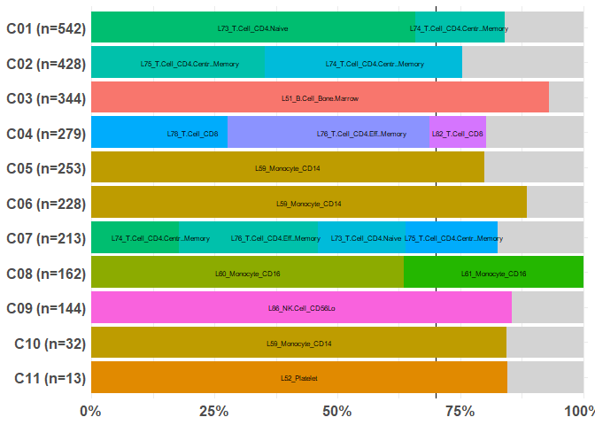

<!-- README.md is generated from README.Rmd. Please edit that file -->

# AnnotateCells

Cell type identification remains a key challenge in single-cell RNA-seq
and spatial transcriptomics datasets despite a decade of research in
this area.

There are many reference-based annotation tools to help with cell type
annotation. However, the input and output formats differ greatly,
increasing the burden on users to use and compare multiple tools.

This package `AnnotateCells` aims to provide a unified wrapper to run
several annotation tools conveniently.

# Installation

We can ensure all the necessary prerequisites are met via

``` r
if (!requireNamespace("pacman", quietly = TRUE)) install.packages("pacman")

pacman::p_load( Seurat, SingleR, celldex )

pacman::p_load_gh("prabhakarlab/RCAv2")
pacman::p_load_gh("JinmiaoChenLab/DISCOtoolkit")
pacman::p_load_gh("satijalab/Azimuth")
```

Next, you can install AnnotateCells:

``` r
pacman::p_load_gh("adairama/AnnotateCells")
```

# Demo dataset

We will load the `pbmc.demo` dataset. This is a Seurat object containing
2,635 peripheral blood mononuclear cells (PBMC) from 10X Genomics
experiment. This is the same dataset used in the fundamental Seurat
vignette after QC filtering with PCA and UMAP embedding. See
`help(pbmc.demo)` for more details.

``` r
library(AnnotateCells)
#> Loading required package: Seurat
#> Warning: package 'Seurat' was built under R version 4.4.3
#> Loading required package: SeuratObject
#> Warning: package 'SeuratObject' was built under R version 4.4.3
#> Loading required package: sp
#> Warning: package 'sp' was built under R version 4.4.2
#> 
#> Attaching package: 'SeuratObject'
#> The following objects are masked from 'package:base':
#> 
#>     intersect, t
#> Loading required package: tidyverse
#> Warning: package 'ggplot2' was built under R version 4.4.3
#> Warning: package 'purrr' was built under R version 4.4.2
#> Warning: package 'lubridate' was built under R version 4.4.2
#> ── Attaching core tidyverse packages ────────────────────────────────────────────────────────────────────────────────────────────── tidyverse 2.0.0 ──
#> ✔ dplyr     1.1.4     ✔ readr     2.1.5
#> ✔ forcats   1.0.0     ✔ stringr   1.5.1
#> ✔ ggplot2   3.5.2     ✔ tibble    3.2.1
#> ✔ lubridate 1.9.4     ✔ tidyr     1.3.1
#> ✔ purrr     1.0.4
#> ── Conflicts ──────────────────────────────────────────────────────────────────────────────────────────────────────────────── tidyverse_conflicts() ──
#> ✖ dplyr::filter() masks stats::filter()
#> ✖ dplyr::lag()    masks stats::lag()
#> ℹ Use the conflicted package (<http://conflicted.r-lib.org/>) to force all conflicts to become errors

data(pbmc.demo)

pbmc.demo
#> An object of class Seurat 
#> 13714 features across 2638 samples within 1 assay 
#> Active assay: RNA (13714 features, 2000 variable features)
#>  2 layers present: counts, data
#>  2 dimensional reductions calculated: pca, umap
```

The Seurat package includes a column called `seurat_annotations`, which
we will treat as the ground truth for evaluating annotation accuracy.

For the purpose of demonstrating the cell annotation workflow, we will
use annotate the 11 clusters found in the `RNA_snn_res.0.8` column.
These clusters were generated using the Louvain algorithm with a
resolution of 0.8.

``` r
pbmc.demo@meta.data %>% head()
#>                nCount_RNA nFeature_RNA percent.mt seurat_annotations RNA_snn_res.0.8
#> AAACATACAACCAC       2419          779       3.02       Memory CD4 T             C07
#> AAACATTGAGCTAC       4903         1352       3.79                  B             C03
#> AAACATTGATCAGC       3147         1129       0.89       Memory CD4 T             C02
#> AAACCGTGCTTCCG       2639          960       1.74         CD14+ Mono             C05
#> AAACCGTGTATGCG        980          521       1.22                 NK             C09
#> AAACGCACTGGTAC       2163          781       1.66       Memory CD4 T             C02

table(pbmc.demo$RNA_snn_res.0.8)
#> 
#> C01 C02 C03 C04 C05 C06 C07 C08 C09 C10 C11 
#> 542 428 344 279 253 228 213 162 144  32  13
```

# Available panels

dt

# Run RCAv2 annotation

Here is an example on how to run the RCAv2 tool with the
GlobalPanel_CellTypes panel.

``` r
pred <- AnnotateCells(pbmc.demo, "RCAv2.GlobalPanel_CellTypes")
#> 
#>  GlobalPanel_CellTypes 
#> 13714 genes in query dataset.
#> 8883 genes detected in at least 1% of the samples.
#> 5209 genes in the reference panel.
#> 1192 genes in common used for projection.

dim(pred)
#> [1] 2638    1

head(pred)
#>                 RCAv2.GlobalPanel_CellTypes
#> AAACATACAACCAC L74_T.Cell_CD4.Centr..Memory
#> AAACATTGAGCTAC       L51_B.Cell_Bone.Marrow
#> AAACATTGATCAGC L75_T.Cell_CD4.Centr..Memory
#> AAACCGTGCTTCCG            L60_Monocyte_CD16
#> AAACCGTGTATGCG           L86_NK.Cell_CD56Lo
#> AAACGCACTGGTAC L75_T.Cell_CD4.Centr..Memory
```

Let us add the prediction to the Seurat object.

``` r
pbmc.demo <- AddMetaData(pbmc.demo, pred)
```

# Run DISCO annotation

The first time you run the DISCO annotation, the required reference data
(~175 MB) will be downloaded from the server. This may take a few
minutes (\<5 min), depending on your internet speed. The downloaded data
will be stored in the data directory of the `AnnotateCells` package for
future use.

``` r
pred <- AnnotateCells(pbmc.demo, "DISCO.all")
#> As of Seurat v5, we recommend using AggregateExpression to perform pseudo-bulk analysis.
#> Downloading reference data from server...
#> 
#> Download complete. File saved to: C:/Users/aramasamy/AppData/Local/R/win-library/4.4/AnnotateCells/data/ref_data.rds
#> 
#> Downloading reference deg from server...
#> 
#> Download complete. File saved to: C:/Users/aramasamy/AppData/Local/R/win-library/4.4/AnnotateCells/data/ref_deg.rds
#> 
#> Loading required package: DISCOtoolkit
#> 
#> Welcome to DISCOtoolkit.
#> 
#> This message is displayed once per session.
#> 
#> 
#> |Ident |predict_cell_type_1 |source_atlas_1    | score_1|
#> |:-----|:-------------------|:-----------------|-------:|
#> |6     |GZMK CD8 T cell     |sarcoidosis_blood |   0.826|
#> |2     |Naive B cell        |sarcoidosis_blood |   0.841|
#> |1     |Memory CD4 T cell   |sarcoidosis_blood |   0.943|
#> |4     |CD14 monocyte       |COVID-19_blood    |   0.833|
#> |8     |CD16 NK cell        |COVID-19_blood    |   0.838|
#> |3     |Memory CD8 T cell   |dengue_blood      |   0.810|
#> |7     |CD16 monocyte       |HNSCC_blood       |   0.864|
#> |0     |Naive CD4 T cell    |HNSCC_blood       |   0.967|
#> |5     |CD14 monocyte       |COVID-19_blood    |   0.854|
#> |9     |Dendritic cell      |HNSCC_blood       |   0.891|
#> |10    |Megakaryocyte       |sarcoidosis_blood |   0.776|

pbmc.demo <- AddMetaData(pbmc.demo, pred)

head(pbmc.demo@meta.data)
#>                nCount_RNA nFeature_RNA percent.mt seurat_annotations RNA_snn_res.0.8  RCAv2.GlobalPanel_CellTypes         DISCO.all
#> AAACATACAACCAC       2419          779       3.02       Memory CD4 T             C07 L74_T.Cell_CD4.Centr..Memory   GZMK CD8 T cell
#> AAACATTGAGCTAC       4903         1352       3.79                  B             C03       L51_B.Cell_Bone.Marrow      Naive B cell
#> AAACATTGATCAGC       3147         1129       0.89       Memory CD4 T             C02 L75_T.Cell_CD4.Centr..Memory Memory CD4 T cell
#> AAACCGTGCTTCCG       2639          960       1.74         CD14+ Mono             C05            L60_Monocyte_CD16     CD14 monocyte
#> AAACCGTGTATGCG        980          521       1.22                 NK             C09           L86_NK.Cell_CD56Lo      CD16 NK cell
#> AAACGCACTGGTAC       2163          781       1.66       Memory CD4 T             C02 L75_T.Cell_CD4.Centr..Memory Memory CD4 T cell
```

# Aligning annotation from cell-level to group-level

With the exception of the DISCO reference tool, `AnnotateCells()`
provides predictions at the individual cell level. Aligning these
predicted cell type labels to cluster groups can be advantageous.
However, each cluster may contain multiple prediction labels as the
cross table below demonstrates,

``` r
table( pbmc.demo$RCAv2.GlobalPanel_CellTypes,
       pbmc.demo$RNA_snn_res.0.8 ) %>% 
  print(zero.print = ".")
#>                                      
#>                                       C01 C02 C03 C04 C05 C06 C07 C08 C09 C10 C11
#>   L2_ESC                                .   .   .   .   .   .   1   .   .   .   .
#>   L45_CMP_Bone.Marrow                   4   .   .   .   .   .   1   .   .   .   1
#>   L48_Myelocyte_Bone.Marrow             .   .   .   .   .   2   .   .   .   .   .
#>   L51_B.Cell_Bone.Marrow                .   . 320   .   .   .   .   .   .   .   .
#>   L52_Platelet                          .   .   .   .   .   .   .   .   .   .  11
#>   L59_Monocyte_CD14                     .   .   .   . 202 202   .   .   .  27   .
#>   L60_Monocyte_CD16                     .   .   .   .  50  17   . 103   .   .   .
#>   L61_Monocyte_CD16                     .   .   .   .   .   .   .  59   .   .   .
#>   L62_Monocyte                          .   .   .   .   .   3   .   .   .   .   1
#>   L64_Macrophage_Monocyte.derived       .   .   .   .   1   4   .   .   .   .   .
#>   L69_Dendritic.Cell_Monocyte.derived   .   .   .   .   .   .   .   .   .   1   .
#>   L72_Dendritic.Cell_Plasmacytoid       .   .   .   .   .   .   .   .   .   4   .
#>   L73_T.Cell_CD4.Naive                357  49   .   .   .   .  38   .   .   .   .
#>   L74_T.Cell_CD4.Centr..Memory         98 151   .  23   .   .  60   .   .   .   .
#>   L75_T.Cell_CD4.Centr..Memory         68 172   .   .   .   .  38   .   .   .   .
#>   L76_T.Cell_CD4.Eff..Memory            6  53   .  77   .   .  40   .   .   .   .
#>   L77_T.Cell_CD8.Centr..Memory          .   .   .   4   .   .   1   .   .   .   .
#>   L78_T.Cell_CD8                        2   2   . 115   .   .  16   .   5   .   .
#>   L80_T.Cell_CD8.Eff..Memory            7   .   .   1   .   .   8   .   .   .   .
#>   L81_T.Cell_CD8.Naive                  .   .   .   2   .   .   3   .   .   .   .
#>   L82_T.Cell_CD8                        .   1   1  32   .   .   6   .   4   .   .
#>   L85_NK.Cell_CD56Hi                    .   .   .  10   .   .   1   .  12   .   .
#>   L86_NK.Cell_CD56Lo                    .   .   .  15   .   .   .   . 123   .   .
#>   L89_B.Cell                            .   .   2   .   .   .   .   .   .   .   .
#>   L90_B.Cell_Naive                      .   .  16   .   .   .   .   .   .   .   .
#>   L92_B.Cell_Memory                     .   .   2   .   .   .   .   .   .   .   .
#>   L93_B.Cell_Plasma.Cell                .   .   3   .   .   .   .   .   .   .   .
```

It can be easier to visualize this information (e.g. cluster 3) via the
following barplot. The segments are ordered in descending order of
popularity until at least 70% of the cells are accounted for (you can
adjust this using the `thres` parameter). The remaining labels are
lumped together as Misc. and colored in grey.

``` r
align_prediction_to_cluster(
  prediction = pbmc.demo$RCAv2.GlobalPanel_CellTypes,
  cluster    = pbmc.demo$RNA_snn_res.0.8 
)
#> Warning: Removed 10 rows containing missing values or values outside the scale range (`geom_text()`).
```



Here is an alternative text output:

``` r
align_prediction_to_cluster(
  prediction = pbmc.demo$RCAv2.GlobalPanel_CellTypes,
  cluster    = pbmc.demo$RNA_snn_res.0.8,
  type       = "split"
)
#> $C01
#>   cluster                   prediction   n      prop   cumprop
#> 1     C01         L73_T.Cell_CD4.Naive 357 0.6586716 0.6586716
#> 2     C01 L74_T.Cell_CD4.Centr..Memory  98 0.1808118 0.8394834
#> 3     C01                        Misc.  87 0.1605166 1.0000000
#> 
#> $C02
#>   cluster                   prediction   n      prop   cumprop
#> 4     C02 L75_T.Cell_CD4.Centr..Memory 172 0.4018692 0.4018692
#> 5     C02 L74_T.Cell_CD4.Centr..Memory 151 0.3528037 0.7546729
#> 6     C02                        Misc. 105 0.2453271 1.0000000
#> 
#> $C03
#>   cluster             prediction   n       prop   cumprop
#> 7     C03 L51_B.Cell_Bone.Marrow 320 0.93023256 0.9302326
#> 8     C03                  Misc.  24 0.06976744 1.0000000
#> 
#> $C04
#>    cluster                 prediction   n      prop   cumprop
#> 9      C04             L78_T.Cell_CD8 115 0.4121864 0.4121864
#> 10     C04 L76_T.Cell_CD4.Eff..Memory  77 0.2759857 0.6881720
#> 11     C04             L82_T.Cell_CD8  32 0.1146953 0.8028674
#> 12     C04                      Misc.  55 0.1971326 1.0000000
#> 
#> $C05
#>    cluster        prediction   n     prop  cumprop
#> 13     C05 L59_Monocyte_CD14 202 0.798419 0.798419
#> 14     C05             Misc.  51 0.201581 1.000000
#> 
#> $C06
#>    cluster        prediction   n      prop   cumprop
#> 15     C06 L59_Monocyte_CD14 202 0.8859649 0.8859649
#> 16     C06             Misc.  26 0.1140351 1.0000000
#> 
#> $C07
#>    cluster                   prediction  n      prop   cumprop
#> 17     C07 L74_T.Cell_CD4.Centr..Memory 60 0.2816901 0.2816901
#> 18     C07   L76_T.Cell_CD4.Eff..Memory 40 0.1877934 0.4694836
#> 19     C07         L73_T.Cell_CD4.Naive 38 0.1784038 0.6478873
#> 20     C07 L75_T.Cell_CD4.Centr..Memory 38 0.1784038 0.8262911
#> 21     C07                        Misc. 37 0.1737089 1.0000000
#> 
#> $C08
#>    cluster        prediction   n      prop   cumprop
#> 22     C08 L60_Monocyte_CD16 103 0.6358025 0.6358025
#> 23     C08 L61_Monocyte_CD16  59 0.3641975 1.0000000
#> 
#> $C09
#>    cluster         prediction   n      prop   cumprop
#> 24     C09 L86_NK.Cell_CD56Lo 123 0.8541667 0.8541667
#> 25     C09              Misc.  21 0.1458333 1.0000000
#> 
#> $C10
#>    cluster        prediction  n    prop cumprop
#> 26     C10 L59_Monocyte_CD14 27 0.84375 0.84375
#> 27     C10             Misc.  5 0.15625 1.00000
#> 
#> $C11
#>    cluster   prediction  n      prop   cumprop
#> 28     C11 L52_Platelet 11 0.8461538 0.8461538
#> 29     C11        Misc.  2 0.1538462 1.0000000
```
