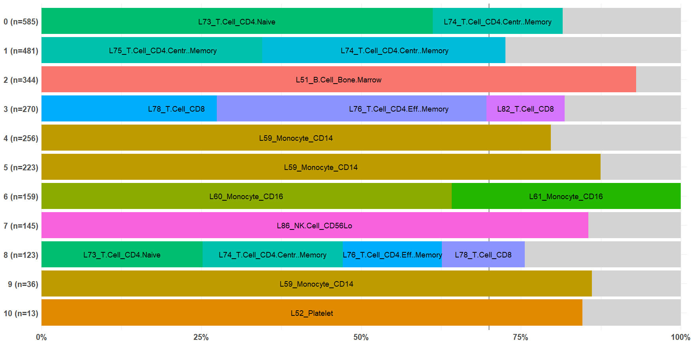

<!-- README.md is generated from README.Rmd. Please edit that file -->

# AnnotateCells

<!-- badges: start -->
<!-- badges: end -->

Cell type identification remains a key challenge in single-cell RNA-seq
and spatial transcriptomics datasets despite a decade of research in
this area.

There are many reference-based annotation tools to help with cell type
annotation. However, the input and output formats differ greatly,
increasing the burden on users to use and compare multiple tools.

This package `AnnotateCells` aims to provide a unified wrapper to run
several annotation tools conveniently.

## Installation

You can install AnnotateCells:

``` r
library(remotes)
install_github("adairama/AnnotateCells")
```

# Illustration

## Demo dataset

We will load the `pbmc.demo` dataset. This is a Seurat object containing
2,635 peripheral blood mononuclear cells (PBMC) from 10X Genomics
experiment. This is the same dataset used in the fundamental Seurat
vignette after QC filtering with PCA and UMAP embedding. See
help(pbmc.demo) for more details.

``` r
library(AnnotateCells)
#> Loading required package: Seurat
#> Loading required package: SeuratObject
#> Loading required package: sp
#> 
#> Attaching package: 'SeuratObject'
#> The following objects are masked from 'package:base':
#> 
#>     intersect, t
#> Loading required package: tidyverse
#> ── Attaching core tidyverse packages ──────────────────────── tidyverse 2.0.0 ──
#> ✔ dplyr     1.1.4     ✔ readr     2.1.5
#> ✔ forcats   1.0.0     ✔ stringr   1.5.1
#> ✔ ggplot2   3.5.1     ✔ tibble    3.2.1
#> ✔ lubridate 1.9.3     ✔ tidyr     1.3.1
#> ✔ purrr     1.0.2     
#> ── Conflicts ────────────────────────────────────────── tidyverse_conflicts() ──
#> ✖ dplyr::filter() masks stats::filter()
#> ✖ dplyr::lag()    masks stats::lag()
#> ℹ Use the conflicted package (<http://conflicted.r-lib.org/>) to force all conflicts to become errors

data(pbmc.demo)

pbmc.demo@meta.data %>% head()
#>                nCount_RNA nFeature_RNA percent.mt seurat_annotations
#> AAACATACAACCAC       2419          779        3.0       Memory CD4 T
#> AAACATTGAGCTAC       4903         1352        3.8                  B
#> AAACATTGATCAGC       3147         1129        0.9       Memory CD4 T
#> AAACCGTGCTTCCG       2639          960        1.7         CD14+ Mono
#> AAACCGTGTATGCG        980          521        1.2                 NK
#> AAACGCACTGGTAC       2163          781        1.7       Memory CD4 T
#>                RNA_snn_res.0.8
#> AAACATACAACCAC               1
#> AAACATTGAGCTAC               2
#> AAACATTGATCAGC               1
#> AAACCGTGCTTCCG               4
#> AAACCGTGTATGCG               7
#> AAACGCACTGGTAC               1
```

The authors of Seurat package provided `seurat_annotations`. However, we
will use `RNA_snn_res.0.8` which represents the communities detected
using Louvain algorithm at a resolution 0.8.

``` r
pbmc.demo@meta.data %>% 
  janitor::tabyl(RNA_snn_res.0.8)
#>  RNA_snn_res.0.8   n     percent
#>                0 585 0.222011385
#>                1 481 0.182542694
#>                2 344 0.130550285
#>                3 270 0.102466793
#>                4 256 0.097153700
#>                5 223 0.084629981
#>                6 159 0.060341556
#>                7 145 0.055028463
#>                8 123 0.046679317
#>                9  36 0.013662239
#>               10  13 0.004933586
```

## Run RCAv2 annotation

Here is an example on how to run the RCAv2 tool with the
GlobalPanel_CellTypes panel.

``` r
pred <- AnnotateCells(pbmc.demo, "RCAv2.GlobalPanel_CellTypes")
#> 13714 genes in query dataset.
#> 8882 genes detected in at least 1% of the samples.
#> 5209 genes in the reference panel.
#> 1192 genes in common used for projection.

dim(pred)
#> [1] 2635    1

head(pred)
#>                ann.RCAv2.GlobalPanel_CellTypes
#> AAACATACAACCAC    L74_T.Cell_CD4.Centr..Memory
#> AAACATTGAGCTAC          L51_B.Cell_Bone.Marrow
#> AAACATTGATCAGC    L75_T.Cell_CD4.Centr..Memory
#> AAACCGTGCTTCCG               L60_Monocyte_CD16
#> AAACCGTGTATGCG              L86_NK.Cell_CD56Lo
#> AAACGCACTGGTAC    L75_T.Cell_CD4.Centr..Memory
```

Let us add the prediction to the Seurat object.

``` r
pbmc.demo <- AddMetaData(pbmc.demo, pred)
```

## Aligning predicted cell type label with cluster group

With the exception of the DISCO reference tool, `AnnotateCells()`
provides predictions at the individual cell level. Aligning these
predicted cell type labels to cluster groups can be advantageous.
However, each cluster may contain multiple prediction labels as the
cross table below demonstrates,

``` r
pbmc.demo@meta.data %>% 
  janitor::tabyl(ann.RCAv2.GlobalPanel_CellTypes, RNA_snn_res.0.8)
#>      ann.RCAv2.GlobalPanel_CellTypes   0   1   2   3   4   5   6   7  8  9 10
#>                               L2_ESC   0   0   0   0   0   0   0   0  1  0  0
#>                  L45_CMP_Bone.Marrow   4   0   0   0   0   0   0   0  1  0  1
#>            L48_Myelocyte_Bone.Marrow   0   0   0   0   0   2   0   0  0  0  0
#>               L51_B.Cell_Bone.Marrow   0   0 320   0   0   0   0   0  0  0  0
#>                         L52_Platelet   0   0   0   0   0   0   0   0  0  0 11
#>                    L59_Monocyte_CD14   0   0   0   0 204 195   0   0  0 31  0
#>                    L60_Monocyte_CD16   0   0   0   0  51  17 102   0  0  0  0
#>                    L61_Monocyte_CD16   0   0   0   0   0   2  57   0  0  0  0
#>                         L62_Monocyte   0   0   0   0   0   3   0   0  0  0  1
#>      L64_Macrophage_Monocyte.derived   0   0   0   0   1   4   0   0  0  0  0
#>  L69_Dendritic.Cell_Monocyte.derived   0   0   0   0   0   0   0   0  0  1  0
#>      L72_Dendritic.Cell_Plasmacytoid   0   0   0   0   0   0   0   0  0  4  0
#>                 L73_T.Cell_CD4.Naive 358  55   0   0   0   0   0   0 31  0  0
#>         L74_T.Cell_CD4.Centr..Memory 119 166   0  20   0   0   0   0 27  0  0
#>         L75_T.Cell_CD4.Centr..Memory  83 183   0   0   0   0   0   0 12  0  0
#>           L76_T.Cell_CD4.Eff..Memory  11  71   0  74   0   0   0   0 19  0  0
#>         L77_T.Cell_CD8.Centr..Memory   0   0   0   4   0   0   0   0  1  0  0
#>                       L78_T.Cell_CD8   2   3   0 114   0   0   0   5 16  0  0
#>           L80_T.Cell_CD8.Eff..Memory   8   2   0   0   0   0   0   0  6  0  0
#>                 L81_T.Cell_CD8.Naive   0   0   0   2   0   0   0   0  3  0  0
#>                       L82_T.Cell_CD8   0   1   1  33   0   0   0   4  5  0  0
#>                   L85_NK.Cell_CD56Hi   0   0   0  10   0   0   0  12  1  0  0
#>                   L86_NK.Cell_CD56Lo   0   0   0  13   0   0   0 124  0  0  0
#>                           L89_B.Cell   0   0   2   0   0   0   0   0  0  0  0
#>                     L90_B.Cell_Naive   0   0  16   0   0   0   0   0  0  0  0
#>                    L92_B.Cell_Memory   0   0   2   0   0   0   0   0  0  0  0
#>               L93_B.Cell_Plasma.Cell   0   0   3   0   0   0   0   0  0  0  0
```

We can visualize this via

``` r
align_prediction_to_cluster(
  prediction = pbmc.demo$ann.RCAv2.GlobalPanel_CellTypes,
  cluster    = pbmc.demo$RNA_snn_res.0.8,
  text.size  = 3
)
```



Here is an alternative text output:

``` r
align_prediction_to_cluster(
  prediction = pbmc.demo$ann.RCAv2.GlobalPanel_CellTypes,
  cluster    = pbmc.demo$RNA_snn_res.0.8,
  type       = "split"
)
#> $`0`
#>   cluster                   prediction   n      prop   cumprop
#> 1       0         L73_T.Cell_CD4.Naive 358 0.6119658 0.6119658
#> 2       0 L74_T.Cell_CD4.Centr..Memory 119 0.2034188 0.8153846
#> 3       0                        Misc. 108 0.1846154 1.0000000
#> 
#> $`1`
#>   cluster                   prediction   n      prop   cumprop
#> 4       1 L75_T.Cell_CD4.Centr..Memory 183 0.3804574 0.3804574
#> 5       1 L74_T.Cell_CD4.Centr..Memory 166 0.3451143 0.7255717
#> 6       1                        Misc. 132 0.2744283 1.0000000
#> 
#> $`2`
#>   cluster             prediction   n       prop   cumprop
#> 7       2 L51_B.Cell_Bone.Marrow 320 0.93023256 0.9302326
#> 8       2                  Misc.  24 0.06976744 1.0000000
#> 
#> $`3`
#>    cluster                 prediction   n      prop   cumprop
#> 9        3             L78_T.Cell_CD8 114 0.4222222 0.4222222
#> 10       3 L76_T.Cell_CD4.Eff..Memory  74 0.2740741 0.6962963
#> 11       3             L82_T.Cell_CD8  33 0.1222222 0.8185185
#> 12       3                      Misc.  49 0.1814815 1.0000000
#> 
#> $`4`
#>    cluster        prediction   n     prop  cumprop
#> 13       4 L59_Monocyte_CD14 204 0.796875 0.796875
#> 14       4             Misc.  52 0.203125 1.000000
#> 
#> $`5`
#>    cluster        prediction   n      prop   cumprop
#> 15       5 L59_Monocyte_CD14 195 0.8744395 0.8744395
#> 16       5             Misc.  28 0.1255605 1.0000000
#> 
#> $`6`
#>    cluster        prediction   n      prop   cumprop
#> 17       6 L60_Monocyte_CD16 102 0.6415094 0.6415094
#> 18       6 L61_Monocyte_CD16  57 0.3584906 1.0000000
#> 
#> $`7`
#>    cluster         prediction   n      prop   cumprop
#> 19       7 L86_NK.Cell_CD56Lo 124 0.8551724 0.8551724
#> 20       7              Misc.  21 0.1448276 1.0000000
#> 
#> $`8`
#>    cluster                   prediction  n      prop   cumprop
#> 21       8         L73_T.Cell_CD4.Naive 31 0.2520325 0.2520325
#> 22       8 L74_T.Cell_CD4.Centr..Memory 27 0.2195122 0.4715447
#> 23       8   L76_T.Cell_CD4.Eff..Memory 19 0.1544715 0.6260163
#> 24       8               L78_T.Cell_CD8 16 0.1300813 0.7560976
#> 25       8                        Misc. 30 0.2439024 1.0000000
#> 
#> $`9`
#>    cluster        prediction  n      prop   cumprop
#> 26       9 L59_Monocyte_CD14 31 0.8611111 0.8611111
#> 27       9             Misc.  5 0.1388889 1.0000000
#> 
#> $`10`
#>    cluster   prediction  n      prop   cumprop
#> 28      10 L52_Platelet 11 0.8461538 0.8461538
#> 29      10        Misc.  2 0.1538462 1.0000000
```
